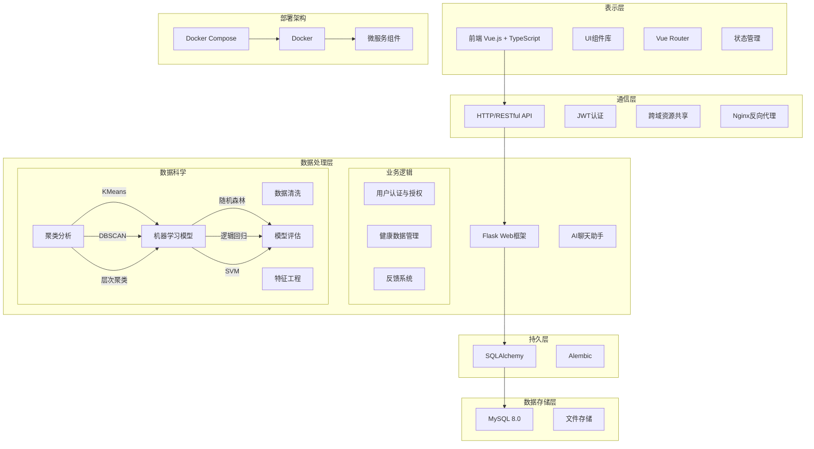

```mermaid
graph TD
    %% 定义主要层级
    subgraph 表示层
        F[前端 Vue.js + TypeScript]
        UI[UI组件库]
        Router[Vue Router]
        StateManagement[状态管理]
    end
    
    subgraph 通信层
        REST[HTTP/RESTful API]
        JWT[JWT认证]
        CORS[跨域资源共享]
        Nginx[Nginx反向代理]
    end
    
    subgraph 数据处理层
        Flask[Flask Web框架]
        subgraph 业务逻辑
            Auth[用户认证与授权]
            HealthData[健康数据管理]
            Feedback[反馈系统]
        end
        subgraph 数据科学
            DataClean[数据清洗]
            FeatureEng[特征工程]
            Cluster[聚类分析]
            ML[机器学习模型]
            Eval[模型评估]
        end
        AI[AI聊天助手]
    end
    
    subgraph 持久层
        ORM[SQLAlchemy]
        Migration[Alembic]
    end
    
    subgraph 数据存储层
        MySQL[MySQL 8.0]
        FileStorage[文件存储]
    end
    
    subgraph 部署架构
        Docker[Docker]
        DockerCompose[Docker Compose]
        Services[微服务组件]
    end
    
    %% 定义层级间关系
    F --> REST
    REST --> Flask
    Flask --> ORM
    ORM --> MySQL
    
    %% 聚类和机器学习模型
    Cluster --> |KMeans|ML
    Cluster --> |DBSCAN|ML
    Cluster --> |层次聚类|ML
    
    ML --> |随机森林|Eval
    ML --> |逻辑回归|Eval
    ML --> |SVM|Eval
    
    %% 部署关系
    DockerCompose --> Docker
    Docker --> Services
``` 