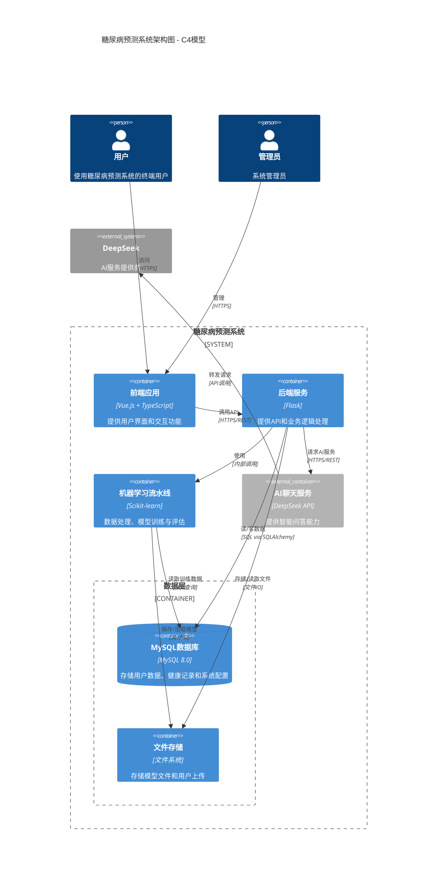

```mermaid
C4Context
    title 糖尿病预测系统架构图 - C4模型

    Person(user, "用户", "使用糖尿病预测系统的终端用户")
    Person(admin, "管理员", "系统管理员")
    
    System_Boundary(diabetes_system, "糖尿病预测系统") {
        Container(frontend, "前端应用", "Vue.js + TypeScript", "提供用户界面和交互功能")
        Container(backend, "后端服务", "Flask", "提供API和业务逻辑处理")
        Container(ml_pipeline, "机器学习流水线", "Scikit-learn", "数据处理、模型训练与评估")
        
        Container_Boundary(data_layer, "数据层") {
            ContainerDb(mysql, "MySQL数据库", "MySQL 8.0", "存储用户数据、健康记录和系统配置")
            Container(file_storage, "文件存储", "文件系统", "存储模型文件和用户上传")
        }
        
        Container_Ext(ai_service, "AI聊天服务", "DeepSeek API", "提供智能问答能力")
    }
    
    %% 外部依赖关系
    System_Ext(deepseek, "DeepSeek", "AI服务提供商")
    
    %% 关系定义
    Rel(user, frontend, "访问", "HTTPS")
    Rel(admin, frontend, "管理", "HTTPS")
    
    Rel(frontend, backend, "调用API", "HTTPS/REST")
    Rel(backend, ml_pipeline, "使用", "内部调用")
    Rel(backend, mysql, "读/写数据", "SQL via SQLAlchemy")
    Rel(backend, file_storage, "存储/读取文件", "文件IO")
    Rel(backend, ai_service, "请求AI服务", "HTTPS/REST")
    
    Rel(ml_pipeline, mysql, "读取训练数据", "SQL查询")
    Rel(ml_pipeline, file_storage, "保存/加载模型", "文件IO")
    
    Rel(ai_service, deepseek, "转发请求", "API调用")

    UpdateRelStyle(user, frontend, $offsetY="-40", $offsetX="0")
    UpdateRelStyle(admin, frontend, $offsetY="40", $offsetX="0")
``` 