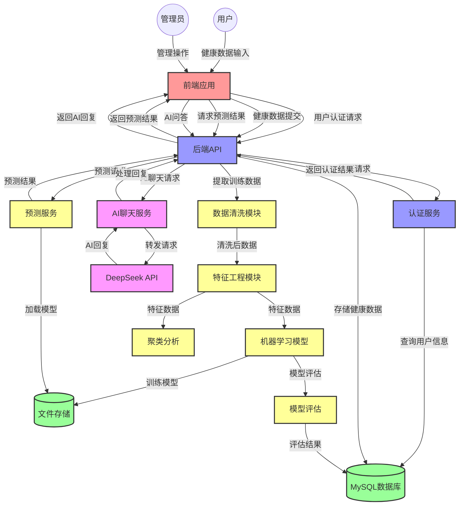

```mermaid
flowchart TD
    %% 定义节点
    User((用户))
    Admin((管理员))
    FrontEnd[前端应用]
    API[后端API]
    Auth[认证服务]
    DB[(MySQL数据库)]
    FileStore[(文件存储)]
    
    %% 数据处理模块
    DataClean[数据清洗模块]
    FeatureEng[特征工程模块]
    ML[机器学习模型]
    
    %% 分析和预测
    Cluster[聚类分析]
    Predict[预测服务]
    Eval[模型评估]
    
    %% AI服务
    AIChat[AI聊天服务]
    DeepSeek[DeepSeek API]

    %% 定义数据流
    User -->|健康数据输入| FrontEnd
    Admin -->|管理操作| FrontEnd
    FrontEnd -->|用户认证请求| API
    FrontEnd -->|健康数据提交| API
    FrontEnd -->|请求预测结果| API
    FrontEnd -->|AI问答| API
    
    API -->|认证请求| Auth
    Auth -->|查询用户信息| DB
    Auth -->|返回认证结果| API
    
    API -->|存储健康数据| DB
    API -->|提取训练数据| DataClean
    
    DataClean -->|清洗后数据| FeatureEng
    FeatureEng -->|特征数据| ML
    FeatureEng -->|特征数据| Cluster
    
    ML -->|训练模型| FileStore
    ML -->|模型评估| Eval
    Eval -->|评估结果| DB
    
    API -->|预测请求| Predict
    Predict -->|加载模型| FileStore
    Predict -->|预测结果| API
    API -->|返回预测结果| FrontEnd
    
    API -->|AI聊天请求| AIChat
    AIChat -->|转发请求| DeepSeek
    DeepSeek -->|AI回复| AIChat
    AIChat -->|处理回复| API
    API -->|返回AI回复| FrontEnd
    
    %% 样式设置
    classDef frontend fill:#ff9999,stroke:#333,stroke-width:2px
    classDef backend fill:#9999ff,stroke:#333,stroke-width:2px
    classDef data fill:#99ff99,stroke:#333,stroke-width:2px
    classDef ml fill:#ffff99,stroke:#333,stroke-width:2px
    classDef ai fill:#ff99ff,stroke:#333,stroke-width:2px
    
    class FrontEnd frontend
    class API,Auth backend
    class DB,FileStore data
    class DataClean,FeatureEng,ML,Cluster,Predict,Eval ml
    class AIChat,DeepSeek ai
``` 